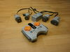
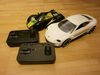

# Toy Motor Controller

Toy Motor Controller aims to provide a simple API to control toys directly from Python.

# Supported products

| Name | | Implemented devices | Further links |
| --- | --- | --- | --- |
| [AKOGD Power Functions](http://www.akogd.com/) |  | [Remote control](examples/akogd-power-functions-remote-control-demo.py), [Hub](examples/akogd-power-functions-hub-demo.py) | [Protocol](docs/protocols/protocol-AKOGD-Power-Functions.md) |
| [Playmobil RC Racers](https://www.playmobil.de/inhalt/play_film_action_rcracers_2017_01/PLAY_FILM_ACTION_RCRACERS_2017_01.html) |  | [Remote control](examples/playmobil-rc-racers-remote-control-demo.py), [Vehicle](examples/playmobil-rc-racers-vehicle-demo.py) | [Protocol](docs/protocols/protocol-Playmobil-Rc-Racers.md) |
