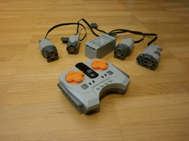
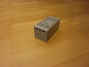

# AKOGD Power Functions

#### Table of Contents

1. [Description](#description)
1. [Supported Features](#supported-features)
1. [Compatible Devices](#compatible-devices)
1. [Protocol](#protocol)
1. [Example Code](#example-code)

# Description

[AKOGD Power Functions](http://www.akogd.com/) are sets of remote
controls, and hubs that allow to connect motors. The devices are
structurally compatible with common [interlocking brick
toys](https://en.wikipedia.org/wiki/Lego).

The official Android app, which can act as remote control for hubs, is
not in the Google Play Store, but has to be downloaded and installed
manually from http://aibei.codetoys.net/download
(The URL doesn't seem to work from desktop computers, but does work
from Chrome on Android).

# Supported features

Toy Motor Controller fully supports simulating both AKOGD Power Functions
[remote
controls](../../toy_motor_controller/toy/akogd_power_functions/remote_control.py)
([example](../../examples/akogd-power-functions-remote-control-demo.py)),
and
[hubs](../../toy_motor_controller/toy/akogd_power_functions/hub.py)
([example](../../examples/akogd-power-functions-hub-demo.py)).

Multiple different devices can be spawned simultaneously and independently.

All devices support automatic scanning.

# Compatible Devices

Toy Motor Controller's AKOGD Power Functions classes are known to support:

| Name | Link | Last seen on |
| --- | --- | --- |
| AKOGD Technik Power Functions, Technik motoren Set, Technik Batteriebox Set, 8 Teile Kompatibel mit Lego Technic | https://www.amazon.de/dp/B09J8HTTQW/ | 2022-10-27 |
| AKOGD Power Functions Set, Motoren Set mit Motor, Fernbedienung, Batteriebox, M/L-Motor, Extension Wire Kompatibel mit vielen Modellen (#4) | https://www.amazon.de/dp/B09M3QFPSZ/ | 2022-10-27 |

Due to similarity in form and function they most likely also work with:

| Name | Link | Last seen on |
| --- | --- | --- |
| AKOGD Power Functions Set, Motoren Set mit Motor, Fernbedienung, Batteriebox, LED, Extension Wire Kompatibel mit vielen Modellen (#5) | https://www.amazon.de/dp/B09M3LSN5X/ | 2022-10-27 |
| AKOGD Power Functions Set, Motoren Set mit Motor, Fernbedienung, Batteriebox, Servomotor, L-Motor Kompatibel mit vielen Modellen (#1) | https://www.amazon.de/dp/B09M3NM52R/ | 2022-10-27 |
| AKOGD Power Functions Set, Motoren Set mit Motor, Fernbedienung, Batteriebox, Servomotor, LED, Extension Wire, L-Motor Kompatibel mit vielen Modellen | https://www.amazon.de/dp/B09N2PFNKN/ | 2022-10-27 |
| AKOGD Power Functions Set, Motoren Set mit Motor, Fernbedienung, Batteriebox, Servomotor, XL-Motor Kompatibel mit vielen Modellen (#2)  | https://www.amazon.de/dp/B09M3L678Q/ | 2022-10-27 |
| AKOGD Power Functions Set, Motoren Set mit Motor, Fernbedienung, Batteriebox, XL/M-Motor Kompatibel mit vielen Modellen (#3) | https://www.amazon.de/dp/B09M3LBTB4/ | 2022-10-27 |
| Bybo Technik Power Functions, Technik motoren Set, Technik Batteriebox Set, 4 Teile Kompatibel mit Lego Technic | https://www.amazon.de/dp/B095YTYFYX/ | 2022-10-27 |
| Bybo Technik Power Functions, Technik motoren Set, Technik Batteriebox Set, 8 Teile Kompatibel mit Lego Technic | https://www.amazon.de/dp/B095YBHRDC/ | 2022-10-27 |
| Bybo Technik Power Functions, Technik motoren Set, Technik Batteriebox Set, 8 Teile Kompatibel mit Lego Technic | https://www.amazon.de/dp/B095YL94BW/ | 2022-10-27 |
| WWEI Technik Power Functions Kit, 11 Stück Motoren Fernbedienung Akku für Technik Autos, Kompatibel mit Lego Technic | https://www.amazon.de/dp/B09F9S7VJG/ | 2022-10-27 |
| WWEI Technik Power Functions Kit, 6 Stück Motoren Fernbedienung Akku für Technik Autos, Kompatibel mit Lego Technic | https://www.amazon.de/dp/B09F9R5BMV/ | 2022-10-27 |
| WWEI Technik Power Functions Kit, 8 Stück Motoren Fernbedienung Akku für Technik Autos, Kompatibel mit Lego Technic | https://www.amazon.de/dp/B09F9SL7Z6/ | 2022-10-27 |
| WWEI Technik Power Functions Kit, 8 Stück Motoren Fernbedienung Beleuchtungsset Akku für Technik Autos, Kompatibel mit Lego Technic | https://www.amazon.de/dp/B09F9S5YKJ/ | 2022-10-27 |

# Protocol

The protocol used by AKOGD power functions is based on Bluetooth
advertisements and described in [protocol.md](protocol.md)

# Example Code

[ Example Code:
Remote
Control](../../examples/akogd-power-functions-remote-control-demo.py)

[ Example Code:
Hub](../../examples/akogd-power-functions-hub-demo.py)
