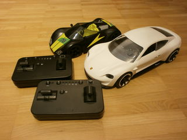
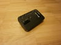
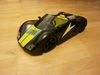

# Playmobil RC Racers



#### Table of Contents

1. [Description](#description)
1. [Supported Features](#supported-features)
1. [Compatible Devices](#compatible-devices)
1. [Protocol](#protocol)
1. [Example Code](#example-code)


# Description

[Playmobil RC Racers](https://www.playmobil.de/inhalt/play_film_action_rcracers_2017_01/PLAY_FILM_ACTION_RCRACERS_2017_01.html)
are remote controls and vehicles fitting into the Playmobil world.

There are two official Android apps available via the Google Play Store:

* [PLAYMOBIL RC-Racer](https://play.google.com/store/apps/details?id=com.playmobil.rcracer)
* [PLAYMOBIL RC Porsche](https://play.google.com/store/apps/details?id=com.playmobil.porsche)

Both apps are able to act as remote control for any Playmobil RC
Racers vehicle, and the apps differ mostly in styling.


# Supported features

Toy Motor Controller fully supports simulating Playmobil RC Racers
[remote
controls](../../toy_motor_controller/toy/playmobil_rc_racers/remote_control.py)
([example](../../examples/playmobil-rc-racers-remote-control-demo.py)).

There is basic support (speed and direction work; light switch and speed
multiplier are not yet functional, as notify support is not there yet) for
simulating Playmobil RC Racers
[vehicles](../../toy_motor_controller/toy/playmobil_rc_racers/vehicle.py)
([example](../../examples/playmobil-rc-racers-vehicle-demo.py)), but in order to
get it to work you need to patch `bluez`:

In `src/shared/ad.c` in the function `bt_ad_add_data` (around line 1005),
comment out the for loop that rejects data elements:

```
//      for (i = 0; i < sizeof(type_reject_list); i++) {
//              if (type == type_reject_list[i])
//                      return false;
//      }
```

This avoids rejecting data elements, for which there are dedicated keywords. But
as setting them via keywords does not have the desired effect (this needs some
more investigation) and setting them via data works, we resort to this hack for
now.


# Compatible Devices

Toy Motor Controller's Playmobil RC Racers classes are known to support:

| Name | Link | Last seen on |
| --- | --- | --- |
| Playmobil 9089 - RC-Supersport-Racer | https://www.amazon.de/dp/B01M20S3MK | 2022-10-28 |
| Playmobil:THE MOVIE 70078 Rex Dasher's Porsche Mission E, Ab 6 Jahren  | https://www.amazon.de/dp/B07P7KKCNS | 2022-10-28 |

Due to similarity in form and function they most likely also work with:

| Name | Link | Last seen on |
| --- | --- | --- |
| PLAYMOBIL Action 9090 RC-Rocket-Racer mit Bluetooth-Steuerung, Ab 6 Jahren [Exklusiv bei Amazon] | https://www.amazon.de/dp/B01M11HLLM | 2022-10-28 |
| PLAYMOBIL® 70765 Porsche Mission E | https://www.amazon.de/dp/B08KTNWCWM | 2022-10-28 |
| Playmobil 9091 - RC-Rock'n'Roll-Racer | https://www.amazon.de/dp/B01LX4TJJJ | 2022-10-28 |


[PLAYMOBIL 6914 Module](https://www.amazon.de/dp/B016MJNEH8) is marketed as
being compatible with Playmobil RC Racers. But since the product's remote
control and receiver have additional pairing buttons and lack buttons for light
and speed multiplier, it's not clear whether it is actually using the same
technology or not.


# Protocol

The protocol used by Playmobil RC Racers is based on Bluetooth advertisements,
writes, and notifications and described in [protocol.md](protocol.md)


# Example Code

[ Example Code:
Remote
Control](../../examples/playmobil-rc-racers-remote-control-demo.py)

[ Example Code:
Vehicle](../../examples/playmobil-rc-racers-vehicle-demo.py)
