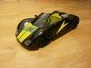

# Playmobil RC Racers communication protocol




This document describes the communication protocol of "Playmobil RC Racers",
which are vehicles, and remote controls.

This document is the basis for the [Playmobil RC Racers implementation in Toy
Motor Controller](README.md).


#### Contents

1. [Overview](#overview)
1. [Bluetooth advertisements](#bluetooth-advertisements)
1. [Bluetooth characteristics](#bluetooth-characteristics)
1. [Commands](#commands)
1. [Hardware remote controls](#hardware-remote-controls)
1. [Software remote controls](#software-remote-controls)
1. [Related projects](#related-projects)
1. [Source](#source)


## Overview

The vehicles start a [Bluetooth LE advertisement](#bluetooth-advertisements) and offer a
[specific characteristic](#Characteristics).

Writing [commands](#commands) to this characteristic controls the vehicle.


## Bluetooth advertisements

The advertisements of this protocol are only done by the vehicle.

The advertisement data is Flags (`0x01`) with value `0x06` (i.e:. LE General
Discoverable Mode and BR/EDR Not Supported), and a Complete Local Name (`0x09`)
of `PM-RC VWXYZ`, where VWXYZ are the last 5 characters when of the vehicle's
Bluetooth address when writing it in upper case hexadecimals.

So a bluetooth address `AC:9A:22:89:CA:FE` would have a Complete Local Name
`PM-RC 9CAFE` in the advertisement.

While [hardware](#hardware-remote-controls) and [software remote
controls](#software-remote-controls) have different, looser requirements, the
above advertisements work for both types of remote controls.

Vehicles typically have a Bluetooth address starting in `AC:9A:22`,
but remote controls connect just fine to other addresses as well.

They typically come from Bluetooth addresses starting in `AC:9A:22`, have a
local name (type `0x09`) starting in `PM-RC `, and characteristic
`06d1e5e7-79ad-4a71-8faa-373789f7d93c`.
Writing [commands](#commands) to this characteristic controls the vehicle.


## Bluetooth Characteristics

Under the service `bc2f4cc6-aaef-4351-9034-d66268e328f0`, the vehicles offer a
characteristic `06d1e5e7-79ad-4a71-8faa-373789f7d93c`.

This characteristic needs to support `write`, `write without response`, and
`notify`.

Writing [commands](#commands) to this characteristic controls the vehicle.


## Commands

Each command written to the [protocol's characteristic](#bluetooth-characteristics) is of
the following form:

```
+------+-------+------+
| TYPE | VALUE | 0x0f |
+------+-------+------+
````

where `TYPE` can only have the following four values:

| `TYPE` | Gist | Description |
| --- | --- | --- |
| `0x23` | speed | `VALUE` controls the speed of the vehicle. `0x00` is full backwards, `0xff` is full forward. Values in between are possible (e.g.: `0xff` is faster forward than `0xb0`). How fast full forward/backward is, can be adjusted through the speed multiplier (see `0x25` below). The dead spot is affected by the speed multiplier as well. It's `0x20-0xd0` for speed multiplier `0x01` down to `0x70-0x90` for speed multiplier `0x05`. The speed set by this command gets reset, if no commands from the vehicle is received for ~0.3s. So to keep the vehicle moving, one has to issue commands about 4 times a second. Any commands will do, they need not be `speed` commands. |
| `0x24` | light | If `VALUE` is `0x01`, the light gets turned on. If it is `0x02`, it gets turned off. Writing such a command results in a `notify` (having the full 3 bytes command as value). This allows remote controls to check if the command was received.|
| `0x25` | speed multiplier | `VALUE` controls how fast the vehicle's full speed (see `0x23` above) is. `0x01` is slowest, `0x05` is fastest. Writing such a command results in a `notify` (having the full 3 bytes command as value). This allows remote controls to check if the command was received.|
| `0x40` | steering | `VALUE` controls the direction the vehicle steers to. `0x00` turns left, `0xff` turns right. Values in between are possible (`0xf0` steers farther to the right than `0xa0`). There does not seem to be a dead spot (other then the wiggle room of the steering mechanism itself). |


## Hardware remote controls

For hardware remote controls to dectect and connect to a device, the BR/EDR Not
Supported flag is not relevant in
[advertisements](#bluetooth-advertisements). The LE General Discoverable Mode
flag is sufficient. Also, for the advertisements's Complete Local Name, the
start `PM-RC ` (including the space as sixth character) is sufficient.

Once a hardware remote control has connected to a vehicle, it remembers this
vehicle's bluetooth address, and it only connects to this very vehicle from now
on. You need to [reset it](#resetting-hardware-remote-controls), to get it to
connect to different vehicle.


### Resetting harware remote controls

To reset a hardware remote control, and thereby allow to connect to a different
vehicle, you need to:

1. Turn the hardware remote control on.
1. Release the remote control's power button.
1. Then press and hold it until the speed multiplier LEDs start to flicker
between left and right again (takes ~6 seconds).
1. Release the power button again.

The remote control has now been reset and it is looking for vehicles to connect
to.


## Software remote controls

For software remote controls to dectect and connect to a device, the LE General
Discoverable Mode flag is not relevant in
[advertisements](#bluetooth-advertisements). The BR/EDR Not Supported flag is
sufficient. Also, for the advertisements's Complete Local Name, the start
`PM-RC` (without a space as sixth character) is sufficient.

The [PLAYMOBIL
RC-Racer](https://play.google.com/store/apps/details?id=com.playmobil.rcracer)
app uses the first 15 characters of the Complete Local Name as initial name for
the car. (While the [PLAYMOBIL RC
Porsche](https://play.google.com/store/apps/details?id=com.playmobil.porsche)
app does not seem the Complete Local Name at all)


## Related projects

* https://github.com/tmonjalo/playmobil-racer

    The basis for our implementation of Playmobil RC Racers remote controls. The project does not support simulating vehicles though.

* https://github.com/doebi/ptpc

    A "tele-presence car" using Playmobil RC Racers. Based on https://github.com/tmonjalo/playmobil-racer

## Source

The initial version of the commands section got sourced from
https://github.com/tmonjalo/playmobil-racer/blob/main/protocol.md and has been
enriched with own observations.
