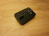

# Playmobil RC Racers communication protocol





This document describes the communication protocol of "Playmobil RC Racers",
which are vehicles, and remote controls.

This document is the basis for the [Playmobil RC Racers implementation in Toy
Motor Controller](README.md).


#### Contents

1. [Overview](#overview)
1. [Advertisements](#advertisements)
1. [Commands](#commands)
1. [Related projects](#related-projects)
1. [Source](#source)


## Overview

The vehicles start a [Bluetooth LE advertisement](#advertisements) offering a specific
characteristic.

Writing [commands](#commands) to this characteristic controls the vehicle.


## Advertisements

The advertisements of this protocol are done by the vehicle.
They typically come from Bluetooth addresses starting in `AC:9A:22`, have a
local name (type `0x09`) starting in `PM-RC `, and characteristic
`06d1e5e7-79ad-4a71-8faa-373789f7d93c`.
Writing [commands](#commands) to this characteristic controls the vehicle.


## Commands

Each command written to the [protocol's characteristic](#advertisements) is of
the following form:

```
+------+-------+------+
| TYPE | VALUE | 0x0f |
+------+-------+------+
````

where `TYPE` can only have the following four values:

| `TYPE` | Gist | Description |
| --- | --- | --- |
| `0x23` | speed | `VALUE` controls the speed of the vehicle. `0x00` is full backwards, `0xff` is full forward. Values in between are possible (e.g.: `0xff` is faster forward than `0xb0`). How fast full forward/backward is, can be adjusted through the speed multiplier (see `0x25` below). The dead spot is affected by the speed multiplier as well. It's `0x20-0xd0` for speed multiplier `0x01` down to `0x70-0x90` for speed multiplier `0x05`. The speed set by this command gets reset after ~0.3s. So to keep the vehicle moving, one has to issue this command about 4 times a second. |
| `0x24` | light | If `VALUE` is `0x01`, the light gets turned on. If it is `0x02`, it gets turned off. |
| `0x25` | speed multiplier | `VALUE` controls how fast the vehicle's full speed (see `0x23` above) is. `0x01` is slowest, `0x05` is fastest. |
| `0x40` | steering | `VALUE` controls the direction the vehicle steers to. `0x00` turns left, `0xff` turns right. Values in between are possible (`0xf0` steers farther to the right than `0xa0`). There does not seem to be a dead spot (other then the wiggle room of the steering mechanism itself). |


## Related projects

* https://github.com/tmonjalo/playmobil-racer

    The basis for our implementation of Playmobil RC Racers remote controls. The project does not support simulating vehicles though.

* https://github.com/doebi/ptpc

    A "tele-presence car" using Playmobil RC Racers. Based on https://github.com/tmonjalo/playmobil-racer

## Source

The main part got sourced from https://github.com/tmonjalo/playmobil-racer/blob/main/protocol.md